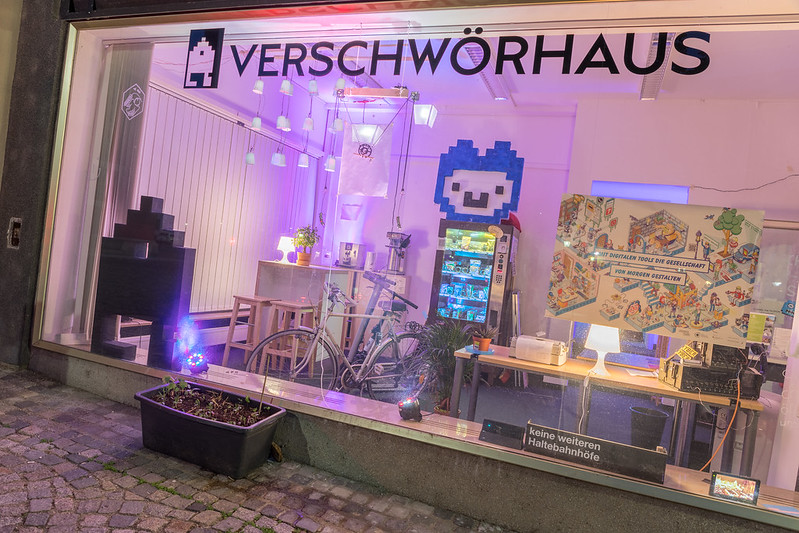

 _Außenansicht des Aquariums des Verschwörhaus. CC BY, [Silvan Reiser](https://konkludenz.de)_

Am 6.5.2022 [berichtete der SWR](https://www.swr.de/swraktuell/baden-wuerttemberg/ulm/neues-nutzungskonzept-fuer-verschwoerhaus-ulm-100.html)
über das im Hauptausschuss beschlossene neue Nutzungskonzept der offenen Werkstatt [Verschwörhaus](https://verschwoerhaus.de/).
Hintergrund ist ein vorausgegangener Streit um die Rechte an Namen "Verschwörhaus" sowie der Ausrichtung des deutschlandweit bekannten Freiraums.

Das Verschwörhaus ist ein offener Treffpunkt in Ulm, in denen sich engagierte Menschen kritisch zu digitalpolitischen Themen austauschen können,
aber auch Technik und Netzkultur gemeinsam erleben können.

**Wir, die Autor:innen und Unterzeichner:innen dieses Briefes sind der festen Überzeugung, dass dieser kritische Freiraum dringend erhalten bleiben muss.
Die vielen Ehrenamtlichen des Verschwörhaus haben in den vergangenen Jahren einen fundamentalen Beitrag zur Digitalisierung beigetragen, deutschlandweit 
wichtige Impulse gesetzt und mit Leidenschaft für offene Konzepte gestritten.**

## Wieso wir das Verschwörhaus wichtig finden

Lorem ipsum dolor sit amet, consectetur adipisicing elit, sed do eiusmod tempor incididunt ut labore et dolore magna aliqua. Ut enim ad minim veniam, quis nostrud exercitation ullamco laboris nisi ut aliquip ex ea commodo consequat. Duis aute irure dolor in reprehenderit in voluptate velit esse cillum dolore eu fugiat nulla pariatur. Excepteur sint occaecat cupidatat non proident, sunt in culpa qui officia deserunt mollit anim id est laborum.

## Unsere Forderungen

Lorem ipsum dolor sit amet, consectetur adipisicing elit, sed do eiusmod tempor incididunt ut labore et dolore magna aliqua. Ut enim ad minim veniam, quis nostrud exercitation ullamco laboris nisi ut aliquip ex ea commodo consequat. Duis aute irure dolor in reprehenderit in voluptate velit esse cillum dolore eu fugiat nulla pariatur. Excepteur sint occaecat cupidatat non proident, sunt in culpa qui officia deserunt mollit anim id est laborum.

## Unterstütze unseren offenen Brief

Du möchtest unser Anliegen unterstützen? Dann unterzeichne doch den offenen Brief, teile ihn unter **#vshbleibt** in den sozialen Netzwerken,
sprich mit deinen Mitmenschen darüber oder unterstütze das Verschwörhaus [direkt durch eine Spende](https://verschwoerhaus.de/spenden/). Werde
aktiv und lass uns ein Zeichen für digitale Freiräume setzen – sie sind die Basis einer kritischen Netzpolitik!

## Autor:innen



## Unterzeichner:innen

